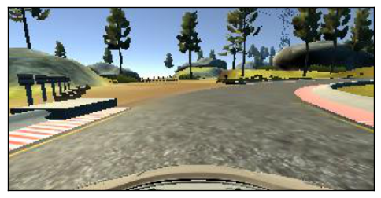
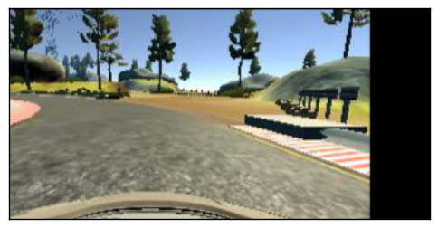

## Project Description

In this project, I use a neural network to clone car driving behavior.  It is a supervised regression problem between the car steering angles and the road images in front of a car.  

Those images were taken from three different camera angles (from the center, the left and the right of the car).  

The network is based on [The NVIDIA model](https://devblogs.nvidia.com/parallelforall/deep-learning-self-driving-cars/), which has been proven to work in this problem domain.

As image processing is involved, the model is using convolutional layers for automated feature engineering.  

### Files included

- `model.py` The script used to create and train the model.
- `drive.py` The script to drive the car. You can feel free to resubmit the original `drive.py` or make modifications and submit your modified version.
- `utils.py` The script to provide useful functionalities (i.e. image preprocessing and augumentation)
- `model.h5` The model weights.
- `environments.yml` conda environment (Use TensorFlow without GPU)
- `environments-gpu.yml` conda environment (Use TensorFlow with GPU)

Note: drive.py is originally from [the Udacity Behavioral Cloning project GitHub](https://github.com/udacity/CarND-Behavioral-Cloning-P3) but it has been modified to control the throttle.

## Quick Start

### Install required python libraries:

You need an [anaconda](https://www.continuum.io/downloads) or [miniconda](https://conda.io/miniconda.html) to use the environment setting.

```python
# Use TensorFlow without GPU
conda env create -f environment.yml 

# Use TensorFlow with GPU
conda env create -f environment-gpu.yml
```

Or you can manually install the required libraries (see the contents of the environment*.yml files) using pip.

### Run the pretrained model

Start up [the Udacity self-driving simulator](https://github.com/udacity/self-driving-car-sim), choose a scene and press the Autonomous Mode button.  Then, run the model as follows:

```python
python drive.py model.h5
```

### To train the model

You'll need the data folder which contains the training images.

```python
python model.py
```

This will generate a file `model-<epoch>.h5` whenever the performance in the epoch is better than the previous best.  For example, the first epoch will generate a file called `model-000.h5`.


## Data Preprocessing

### Image Sizing

- the images are cropped so that the model won’t be trained with the sky and the car front parts
- the images are resized to 66x200 (3 YUV channels) as per NVIDIA model
- the images are normalized (image data divided by 127.5 and subtracted 1.0).  As stated in the Model Architecture section, this is to avoid saturation and make gradients work better)


## Model Training

### Image Augumentation

For training, I used the following augumentation technique along with Python generator to generate unlimited number of images:

- Randomly choose right, left or center images.
- For left image, steering angle is adjusted by +0.2
- For right image, steering angle is adjusted by -0.2
- Randomly flip image left/right
- Randomly translate image horizontally with steering angle adjustment (0.002 per pixel shift)
- Randomly translate image vertically
- Randomly added shadows
- Randomly altering image brightness (lighter or darker)

Using the left/right images is useful to train the recovery driving scenario.  The horizontal translation is useful for difficult curve handling (i.e. the one after the bridge).


### Examples of Augmented Images

The following is the example transformations:

**Center Image**


**Left Image**


**Right Image**


**Flipped Image**



**Translated Image**




## Outcome

The model can drive the course without bumping into the side ways.

## References
- NVIDIA model: https://devblogs.nvidia.com/parallelforall/deep-learning-self-driving-cars/
- Udacity Self-Driving Car Simulator: https://github.com/udacity/self-driving-car-sim
